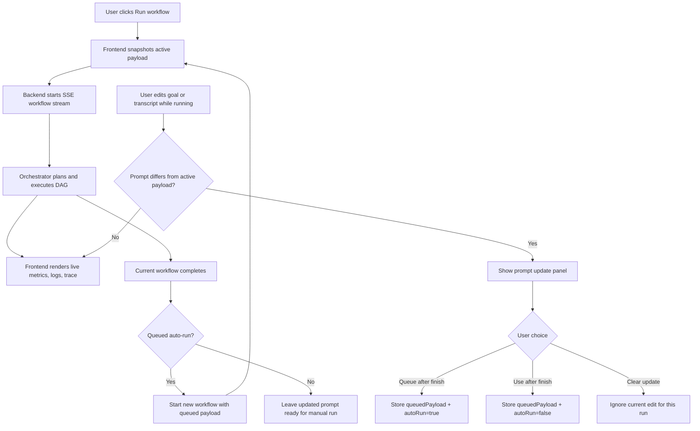
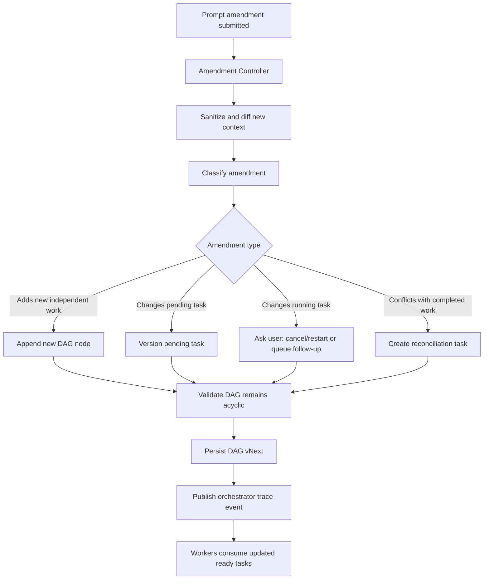

# Workflow Amendment Architecture

This document describes the feature for handling prompt changes after a user has already started a workflow.

## Problem

A user may click **Run workflow** and then remember an extra requirement, constraint, or transcript detail while the orchestrator is already planning or executing. The system needs a safe way to accept that new context without corrupting the active run.

## UX Modes

HiveMindAI supports two user choices when the prompt changes during an active run:

1. **Queue after finish**
   - The edited goal/transcript is stored as the next workflow payload.
   - When the current workflow completes, the queued payload automatically starts as a new workflow.
   - This is the safest option because it does not mutate a running DAG.

2. **Use after finish**
   - The edited goal/transcript is saved in the UI.
   - The current workflow continues unchanged.
   - When the run finishes, the user can manually start the updated prompt.

The current implementation uses these two safe modes. A future live-DAG amendment controller can be added when the runtime has cancellation, task versioning, and worker coordination.

## Current Implemented Flow



## Future Live-Amendment Architecture



## Why Not Mutate Running Work Immediately?

Mutating a live workflow is risky because:

- A task may already be executing with the old prompt.
- A downstream task may depend on old assumptions.
- Human approval may already be pending for an earlier version.
- Artifacts and validation results need version tracking.

The queue-after-finish approach is deterministic and safe for the current architecture.

## Data Model Additions for Future Live Amendments

A future implementation should add:

```text
WorkflowRun
- run_id
- active_payload
- status
- current_dag_id
- current_dag_version

PromptAmendment
- amendment_id
- run_id
- submitted_at
- new_goal
- new_transcript
- diff_summary
- classification
- selected_strategy
- status

TaskNode
- task_id
- dag_version
- supersedes_task_id
- amendment_id
- status
```

## Safety Rules

- Do not expose hidden chain-of-thought.
- Redact API keys, tokens, secrets, and passwords in trace output.
- Do not silently rewrite running tasks.
- If an amendment changes active execution, require explicit user choice.
- Persist every amendment decision for auditability.

## Files Involved in Current Implementation

```text
api/static/index.html     Prompt update panel and buttons
api/static/app.js         Payload snapshot, queue state, auto-run/manual-run behavior
api/demo.py               Existing stream endpoint used by queued runs
orchestrator/             Future location for live amendment controller
```
